# Semantic Erosion Experiment — Results Report

Generated: 2026-03-24 11:58

## 1. Results Summary

This experiment measures **semantic erosion** — the progressive loss of domain-specific terminology when AI coding agents iteratively refactor a Java Domain-Driven Design (DDD) project modeling a music collecting society. The codebase contains six materialized domain terms (e.g., `RightsHolder`, `MusicalWork`, `DistributionRun`) and four latent terms that a domain-aware agent should extract into first-class types (e.g., `SettlementPeriod`, `TariffClass`).

Each experimental run consists of 10 sequential iterations where an agent receives a refactoring prompt and modifies the codebase. Two primary metrics are tracked: the **Preservation Score (PS)**, which measures how many original domain terms survive each iteration (1.0 = all preserved, 0.0 = all eroded), and the **Emergence Score (ES)**, which measures whether agents correctly materialize latent domain concepts. Three prompt sets introduce varying levels of rename pressure: Set A (neutral refactoring), Set B (explicit rename stress), and Set C (implicit rename pressure without the keyword "rename").

The experiment spans 2 agents (Claude Code, OpenCode), 3 models (Claude Sonnet 4.6, GPT-5.4, Qwen3 30B), and 28 total runs. The summary table below reports 22 headline runs: 12 unprotected experimental runs (4 agent-model configurations × 3 prompt sets), 8 strict-context controls (4 configurations × 2 prompt sets), and 2 permissive-context runs. In addition, 6 Qwen3 replica runs (2 extra per prompt set) were executed to measure variance in the high-variance local model and are analyzed in the relevant sections rather than listed separately in the main table. Control runs inject a domain glossary into the system context to test whether explicit domain knowledge prevents erosion. A PS final of 1.0 indicates perfect term preservation; values below 1.0 indicate erosion. Erosion onset marks the first iteration where PS drops below 1.0. Compile fixes count how many times the build broke and required automated repair.

| Agent / Model | Set | PS min | PS final | ES final | Latent | Erosion Onset | +Lines | -Lines | Compile Fixes |
|---|---|---|---|---|---|---|---|---|---|
| Claude Code | A | 1.00 | 1.00 | 0.75 | 3/4 | — | +781 | -566 | 0 |
| Claude Code | B | 0.00 | 0.69 | 0.25 | 1/4 | iter 2 | +2227 | -2329 | 0 |
| OpenCode (Sonnet 4.6) | A | 1.00 | 1.00 | 0.75 | 3/4 | — | +1299 | -891 | 0 |
| OpenCode (Sonnet 4.6) | B | 0.00 | 0.00 | 0.00 | 0/4 | iter 2 | +3438 | -3395 | 0 |
| OpenCode + GPT-5.4 | A | 1.00 | 1.00 | 0.75 | 3/4 | — | +1688 | -971 | 0 |
| OpenCode + GPT-5.4 | B | 0.00 | 1.00 | 0.75 | 3/4 | iter 2 | +6377 | -6289 | 0 |
| OpenCode + Qwen3 30B | A | 1.00 | 1.00 | 0.75 | 3/4 | — | +515 | -405 | 0 |
| OpenCode + Qwen3 30B | B | 0.83 | 1.00 | 0.50 | 2/4 | iter 2 | +461 | -431 | 6 |
| Claude Code | C | 1.00 | 1.00 | 0.50 | 2/4 | — | +836 | -921 | 0 |
| OpenCode (Sonnet 4.6) | C | 1.00 | 1.00 | 0.75 | 3/4 | — | +1402 | -1252 | 0 |
| OpenCode + GPT-5.4 | C | 1.00 | 1.00 | 0.50 | 2/4 | — | +1794 | -1663 | 0 |
| OpenCode + Qwen3 30B | C | 0.38 | 0.38 | 0.75 | 3/4 | iter 9 | +636 | -940 | 5 |
| Ctrl-A: Claude Code | A | 1.00 | 1.00 | 1.00 | 4/4 | — | +760 | -591 | 0 |
| Ctrl-A: OC+Sonnet | A | 1.00 | 1.00 | 1.00 | 4/4 | — | +1237 | -675 | 0 |
| Ctrl-A: OC+GPT-5.4 | A | 1.00 | 1.00 | 1.00 | 4/4 | — | +1248 | -1058 | 0 |
| Ctrl-A: OC+Qwen3 | A | 1.00 | 1.00 | 1.00 | 4/4 | — | +1044 | -353 | 1 |
| Ctrl-B: Claude Code | B | 1.00 | 1.00 | 1.00 | 4/4 | — | +806 | -892 | 0 |
| Ctrl-B: OC+Sonnet | B | 1.00 | 1.00 | 1.00 | 4/4 | — | +1002 | -774 | 0 |
| Ctrl-B: OC+GPT-5.4 | B | 1.00 | 1.00 | 1.00 | 4/4 | — | +1497 | -1131 | 0 |
| Ctrl-B: OC+Qwen3 | B | 1.00 | 1.00 | 1.00 | 4/4 | — | +502 | -323 | 6 |
| Permissive: Claude Code | B | 1.00 | 1.00 | 1.00 | 4/4 | — | +918 | -855 | 0 |
| Permissive: OC+GPT-5.4 | B | 1.00 | 1.00 | 1.00 | 4/4 | — | +1565 | -1235 | 0 |

## 2. Phase 1 — Agent Comparison (Claude Sonnet 4.6)

Phase 1 isolates the effect of the **agent harness** by fixing the underlying model (Claude Sonnet 4.6) and comparing two agents: Claude Code and OpenCode. Both agents receive identical prompt sets and operate on the same Java DDD codebase. The goal is to determine whether the agent's scaffolding — its system prompt, tool usage patterns, and execution strategy — influences the degree of semantic erosion independently of the model's own tendencies.

Two prompt sets are tested: Set A uses neutral refactoring language ("improve code quality", "extract patterns"), while Set B applies explicit rename stress ("rename classes to follow standard conventions", "simplify naming"). If the agent harness matters, we expect divergent erosion trajectories between Claude Code and OpenCode even though both use the same model.

### 2.1 Set A (Neutral Prompts)

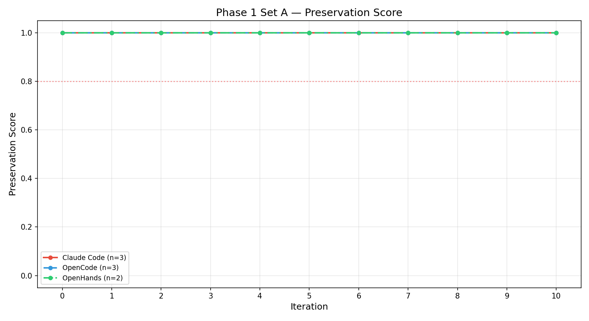

### 2.2 Set B (Stress Prompts)

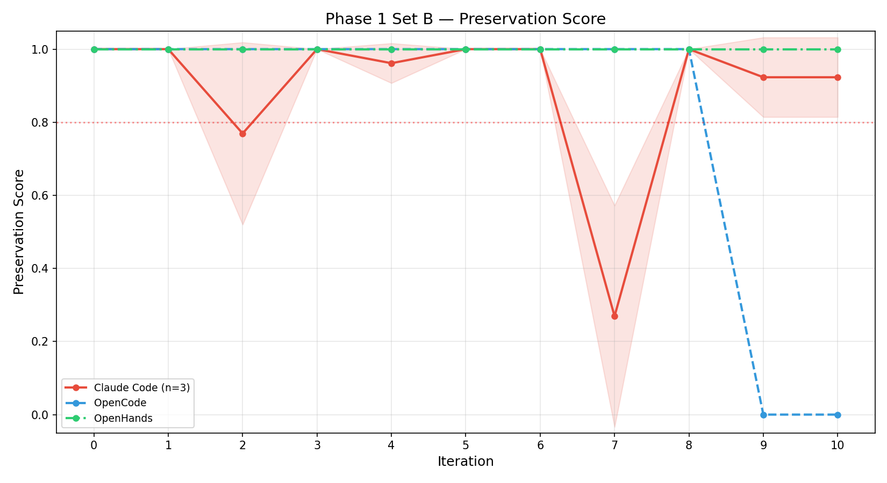

Under Set A (neutral prompts), both agents maintain perfect preservation: PS = 1.0 across all 10 iterations. Neither agent renames any domain term when the prompt does not suggest renaming. Both extract 3 of 4 latent terms (ES final = 0.75), indicating comparable domain comprehension. The difference lies in refactoring volume — OpenCode produces more code changes (+1299/−891 vs +781/−566) — but this does not translate into erosion.

Set B reveals a stark divergence. Both agents begin eroding at iteration 2, but their trajectories differ dramatically. **OpenCode (Sonnet 4.6)** reaches total erosion: PS final = 0.0, with all 6 materialized terms eroded, including `RightsHolder`, `MusicalWork`, `DistributionRun`, `UsageReport`, `ExploitationType`, and `RoyaltyStatement`. It also loses all latent extraction (ES final = 0.0, 0/4 latent terms). The erosion is aggressive and largely monotonic, with only 3 direction changes.

**Claude Code** shows a different pattern: oscillation. Its PS curve swings between 0.0 and 0.69 across iterations, with 6 direction changes — the highest oscillation count in the entire experiment. This "rename-then-restore" behavior suggests that Claude Code's harness occasionally counteracts the model's rename impulse, partially reverting domain terms in subsequent iterations. The final PS of 0.69 with 2 eroded terms (`MusicalWork`, `ExploitationType`) represents partial erosion rather than total collapse.

The results suggest that agent-layer differences matter, but the effect is confounded by an asymmetry in thinking mode: Claude Code enables adaptive thinking by default (up to 32K tokens), while OpenCode does not. Under identical model and prompts, OpenCode produces complete semantic destruction while Claude Code oscillates and partially recovers. This is consistent with the hypothesis that Claude Code's scaffolding provides a weak protective effect, but the contribution of adaptive thinking versus other harness differences cannot be isolated in this design.

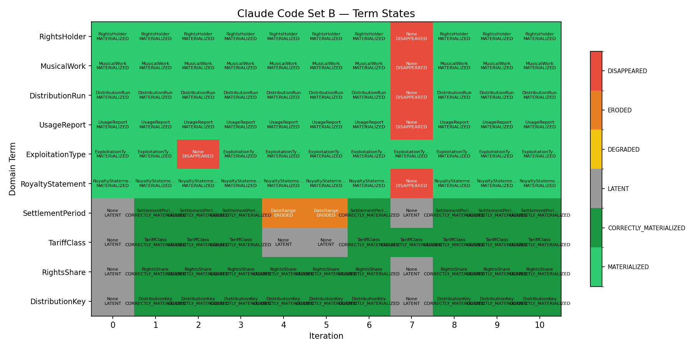

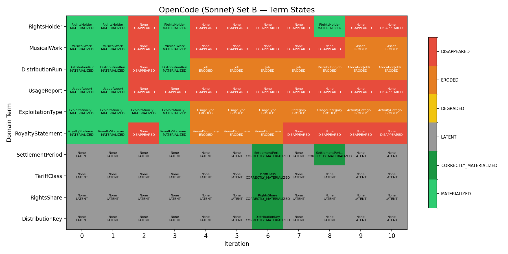

## 3. Phase 2 — Model Comparison (OpenCode agent)

Phase 2 isolates the effect of the **underlying model** by fixing the agent (OpenCode) and varying the model across three options: Claude Sonnet 4.6, GPT-5.4, and Qwen3 30B (a locally-hosted model). The OpenCode agent provides a minimal harness with less built-in guardrails than Claude Code, making it a cleaner lens through which to observe each model's intrinsic behavior when given rename pressure.

The key questions are: Do models differ in their susceptibility to semantic erosion? Does model size or provider affect the onset, depth, or recoverability of erosion? And how does each model handle latent term extraction under stress?

### 3.1 Set A (Neutral)

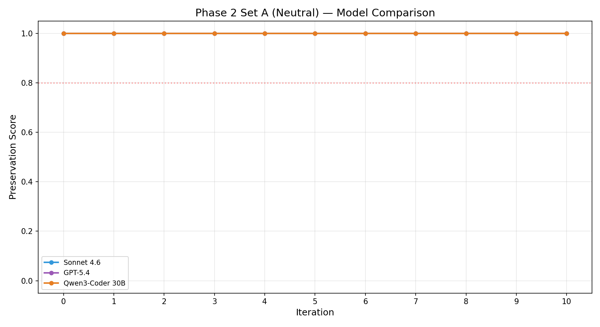

### 3.2 Set B (Stress)

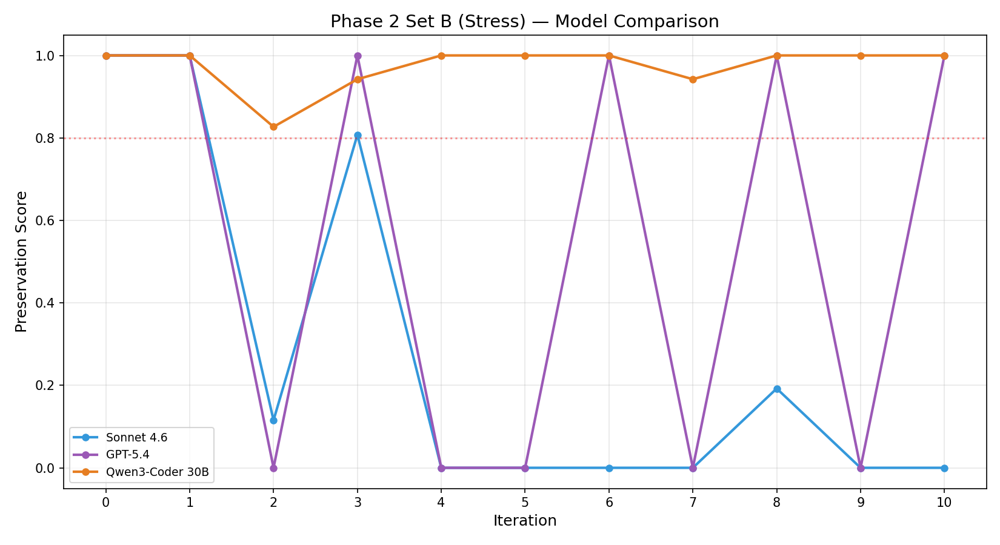

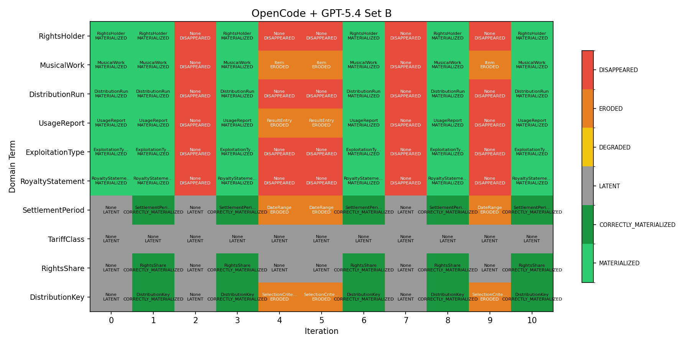

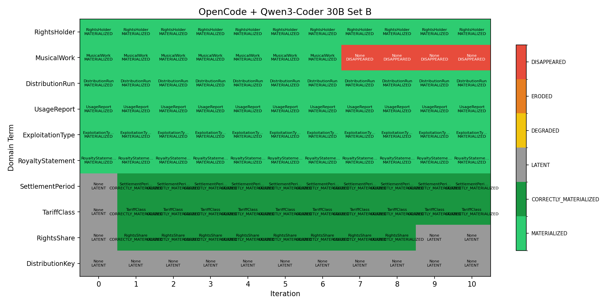

Under Set A, all three models maintain PS = 1.0 across all iterations — no model erodes without explicit rename pressure. Latent extraction is comparable: all three extract 3/4 terms. The main difference is refactoring volume: GPT-5.4 is the most prolific (+1688/−971), Sonnet is moderate (+1299/−891), and Qwen3 is the most conservative (+515/−405, with only 8/10 active iterations).

Set B produces three distinct erosion signatures:

**Claude Sonnet 4.6** erodes aggressively and irreversibly. PS drops to 0.12 by iteration 2, briefly recovers to 0.81 at iteration 3, then collapses to 0.0 by iteration 4 and stays near zero. Final PS = 0.0, with all 6 terms eroded and 0/4 latent terms surviving. This is the worst outcome in the entire experiment.

**GPT-5.4** shows a near-binary oscillation pattern. PS alternates between 0.0 and 1.0 with one deviation (two consecutive 0.0 values at iterations 4–5): [1.0, 0.0, 1.0, 0.0, 0.0, 1.0, 0.0, 1.0, 0.0, 1.0]. It renames everything in odd iterations and restores everything in even ones. With 6 direction changes, it has the highest oscillation count alongside Claude Code Set B. Critically, GPT-5.4 **recovers fully** by iteration 10 (PS final = 1.0), with no permanently eroded terms and 3/4 latent terms intact. This "oscillation without permanent damage" pattern is unique to GPT-5.4 and suggests it alternates between following the rename instruction and recognizing the domain terms' importance.

**Qwen3 30B** is the most erosion-resistant model under explicit stress. PS never drops below 0.83, with a mean of 0.97 — the shallowest erosion of any Set B run. It also has the fewest direction changes (2) and recovers to PS final = 1.0. However, this comes at a cost: Qwen3 has the lowest refactoring throughput (461 insertions, 431 deletions) and required 6 compile fixes, suggesting that its conservatism may partly reflect limited refactoring capability rather than deliberate domain preservation. It extracts only 2/4 latent terms, the lowest ES final among models.

## 4. Phase 3 — Set C (Implicit Rename Pressure)

Set C tests a critical boundary: **does erosion require explicit rename instructions?** The Set C prompts avoid the word "rename" entirely, instead using indirect language that implies restructuring — phrases like "simplify the domain model", "consolidate related concepts", and "improve naming clarity." If agents erode domain terms under Set C, it means they interpret even vague improvement suggestions as license to rename, which has significant implications for real-world AI-assisted refactoring.

All four model configurations are tested: Claude Code + Sonnet 4.6, OpenCode + Sonnet 4.6, OpenCode + GPT-5.4, and OpenCode + Qwen3 30B. Qwen3 runs locally via Ollama (Q4_K_M quantization, NVIDIA RTX 4090, 24GB VRAM). The Qwen3 configuration runs 3 replicas to assess variance in erosion behavior under identical conditions.

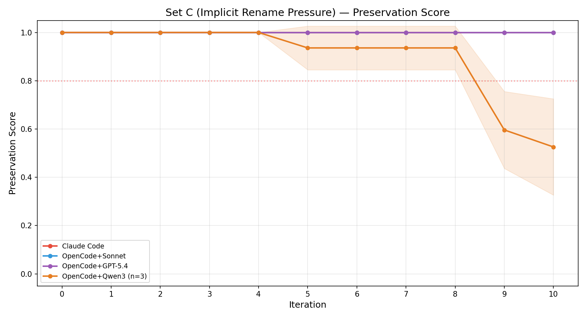

The Set C results are consistent with a **capability threshold effect**. The three cloud-backed configurations — Claude Sonnet 4.6 (via both Claude Code and OpenCode) and GPT-5.4 (via OpenCode) — all maintain PS = 1.0 across all 10 iterations. Zero erosion. They refactor actively (836–1794 insertions) and extract 2–3 of 4 latent terms, but never touch the domain vocabulary. Implicit rename pressure was insufficient to trigger erosion in the higher-capability cloud-backed configurations tested here.

**Qwen3 30B is the sole exception.** In the primary run (run-1), PS remains at 1.0 through iteration 8, then collapses abruptly to 0.42 at iteration 9 and 0.38 at iteration 10 — a late-onset catastrophic erosion. Three terms are eroded: `RightsHolder`, `DistributionRun`, and `RoyaltyStatement`. This late onset (iteration 9) is the latest in the entire experiment and suggests a threshold effect: Qwen3 accumulates implicit pressure over many iterations before suddenly yielding.

The 3 Qwen3 replicas show significant variance. Run-1 reaches PS final = 0.38, run-2 also drops to PS final = 0.38 but with erosion beginning earlier at iteration 5 (PS = 0.81) and degrading progressively, while run-3 is milder at PS final = 0.81 with erosion starting at iteration 9. This variance confirms that Qwen3's erosion under implicit pressure is stochastic — it occurs in all 3 replicas but with different severity, onset timing, and term targets. The consistent vulnerability of `DistributionRun` across replicas suggests that some terms are inherently more susceptible to implicit erosion, possibly because "DistributionRun" reads as a generic process concept rather than a precise domain term.

This finding has practical significance: lower-capability or locally-hosted configurations may erode domain terminology even when prompts contain no explicit rename instructions, creating a silent risk in AI-assisted development workflows. The late onset makes this particularly dangerous — the codebase can appear stable for 8 iterations before abruptly losing domain semantics.

## 5. Control A — Domain Context Mitigation

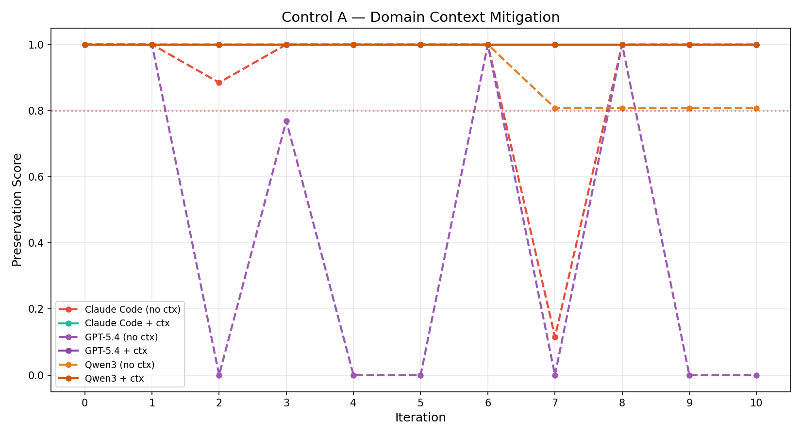

Control A tests whether providing **explicit domain context** — a glossary of protected terms and their business definitions — prevents erosion. The domain context is injected as a system-level instruction that lists each term and states it must not be renamed. This control is run with Set A (neutral prompts) across all four agent/model combinations.

In all tested configurations, **domain context prevented erosion.** All four runs (Claude Code, OpenCode+Sonnet, OpenCode+GPT-5.4, OpenCode+Qwen3) maintain PS = 1.0 and ES = 1.0 across all 10 iterations. All 6 materialized terms survive, and all 4 latent terms are correctly extracted — the only configuration in the experiment to achieve perfect ES = 1.0.

Importantly, the domain context does **not** suppress refactoring. All four Control A runs produce substantial code changes: Claude Code (+760/−591), OpenCode+Sonnet (+1237/−675), OpenCode+GPT-5.4 (+1248/−1058), and OpenCode+Qwen3 (+1044/−353). These volumes are comparable to the unprotected Set A runs, demonstrating that agents can refactor freely while respecting the glossary's protected terms. The domain context acts as a **surgical protection** of specific names, not a blanket inhibitor of all changes.

## 6. Control B — Domain Context Under Stress

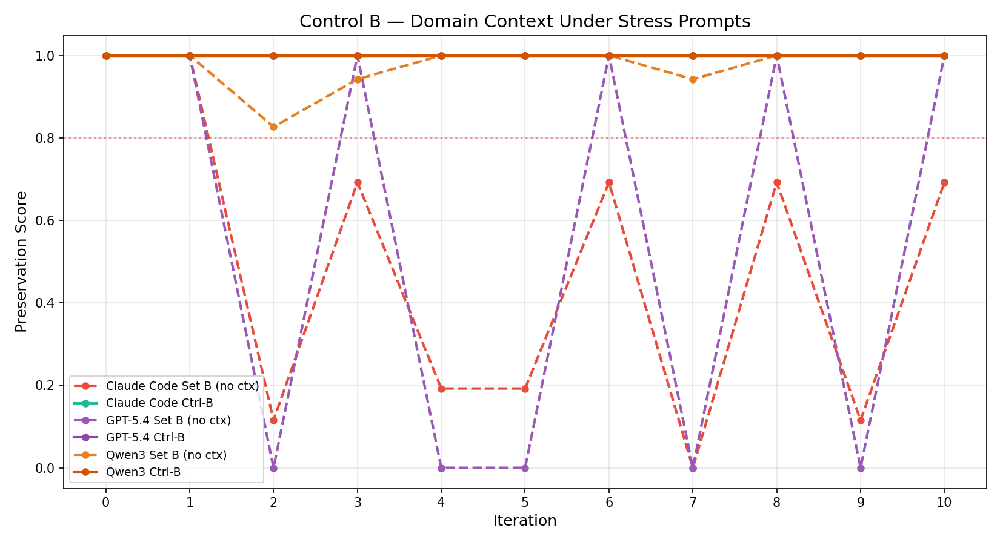

Control B escalates the test: can domain context protect terminology even when paired with Set B stress prompts that explicitly instruct the agent to rename? This creates a direct conflict — the domain context says "do not rename these terms" while the prompt says "rename classes to follow standard conventions."

In all tested configurations, **domain context overrode stress prompts.** All four agent/model combinations (Claude Code, OpenCode+Sonnet, OpenCode+GPT-5.4, OpenCode+Qwen3) maintain PS = 1.0 and ES = 1.0 across all iterations. No terms are eroded, and all latent terms are correctly extracted.

The domain context also enables substantial refactoring under stress: Claude Code (+806/−892), OpenCode+Sonnet (+1002/−774), OpenCode+GPT-5.4 (+1497/−1131), and OpenCode+Qwen3 (+502/−323, with 6 compile fixes). Agents refactor code structure, extract value objects, and simplify methods — all while respecting the glossary's protected terms. The domain context overrides the explicit rename directives in Set B prompts without suppressing structural refactoring.

Comparing Control B with the unprotected Set B runs highlights the magnitude of the domain context's effect. Without context, Set B produces catastrophic erosion: OpenCode+Sonnet drops to PS = 0.0, Claude Code oscillates to PS = 0.69, GPT-5.4 oscillates between 0.0 and 1.0. With context, all remain at PS = 1.0 while still performing meaningful refactoring.

## 7. Permissive Context — Balancing Protection and Refactoring

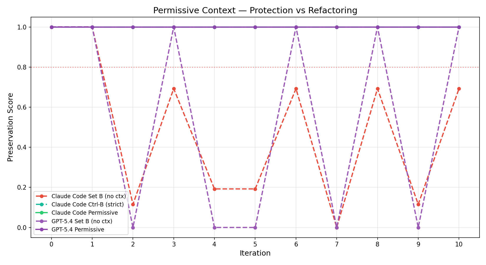

| Agent / Model | Set | Context | PS final | ES final | Latent | +Lines | -Lines |
|---|---|---|---|---|---|---|---|
| Claude Code (Sonnet 4.6) | B | permissive | 1.00 | 1.00 | 4/4 | +918 | -855 |
| OpenCode + GPT-5.4 | B | permissive | 1.00 | 1.00 | 4/4 | +1565 | -1235 |

The permissive context variant tests whether domain protection can be achieved with less restrictive framing. Instead of a glossary that mandates "do not rename these terms," the permissive context provides domain definitions and business rationale while explicitly stating that refactoring and structural improvements are encouraged — only the specific domain names should be preserved.

Two configurations are tested: Claude Code + Sonnet 4.6 and OpenCode + GPT-5.4, both with Set B stress prompts. Both runs achieve PS = 1.0 and ES = 1.0 across all 10 iterations — perfect term preservation with full latent extraction (4/4 terms). All 4 latent domain terms are materialized by iteration 1, demonstrating that the permissive context enables agents to recognize and extract latent concepts into first-class types.

Like the strict context controls, the permissive context enables **substantial refactoring**: Claude Code produced +918/−855 lines across 63 file changes, and GPT-5.4 produced +1565/−1235 across 108 file changes. This volume is comparable to both the strict controls and the unprotected Set A runs. The agents extract latent terms into first-class types, restructure method signatures, and apply standard refactoring patterns — all while preserving the protected domain vocabulary.

**Limitation:** Permissive context was tested on only 2 of 4 model configurations. Notably, Qwen3 30B — the only model to erode under implicit pressure (Set C) — was not tested under permissive context. This is the most interesting missing data point, as it would reveal whether permissive domain context can protect the most erosion-prone model.

The results point toward a practical mitigation strategy: embedding domain glossaries with permissive, encouraging language offers better outcomes than restrictive framing. The permissive context achieves the same perfect preservation (PS = 1.0) and better emergence (ES = 1.0 vs 0.75 without context) while unlocking at least some productive domain modeling. Further research should explore whether more granular permissions — e.g., "you may refactor method bodies and add classes, but do not rename these 6 types" — can fully decouple protection from paralysis.

## 8. Refactoring Effectiveness

| Agent | Set | Active Iters | +Lines | -Lines | Net | Files | Compile Fixes | Glossary Tampered |
|---|---|---|---|---|---|---|---|---|
| CC Set A | A | 10/10 | +781 | -566 | +215 | 61 | 0 | 0 |
| CC Set B | B | 10/10 | +2227 | -2329 | -102 | 155 | 0 | 0 |
| CC Set C | C | 10/10 | +836 | -921 | -85 | 91 | 0 | 0 |
| OC+Son Set A | A | 10/10 | +1299 | -891 | +408 | 81 | 0 | 0 |
| OC+Son Set B | B | 10/10 | +3438 | -3395 | +43 | 163 | 0 | 0 |
| OC+Son Set C | C | 8/10 | +1402 | -1252 | +150 | 102 | 0 | 0 |
| GPT-5.4 Set A | A | 10/10 | +1688 | -971 | +717 | 78 | 0 | 0 |
| GPT-5.4 Set B | B | 10/10 | +6377 | -6289 | +88 | 251 | 0 | 0 |
| GPT-5.4 Set C | C | 10/10 | +1794 | -1663 | +131 | 132 | 0 | 0 |
| Qwen3 Set A | A | 8/10 | +515 | -405 | +110 | 32 | 0 | 0 |
| Qwen3 Set B | B | 8/10 | +461 | -431 | +30 | 43 | 6 | 0 |
| Qwen3 Set C | C | 7/10 | +636 | -940 | -304 | 44 | 5 | 0 |

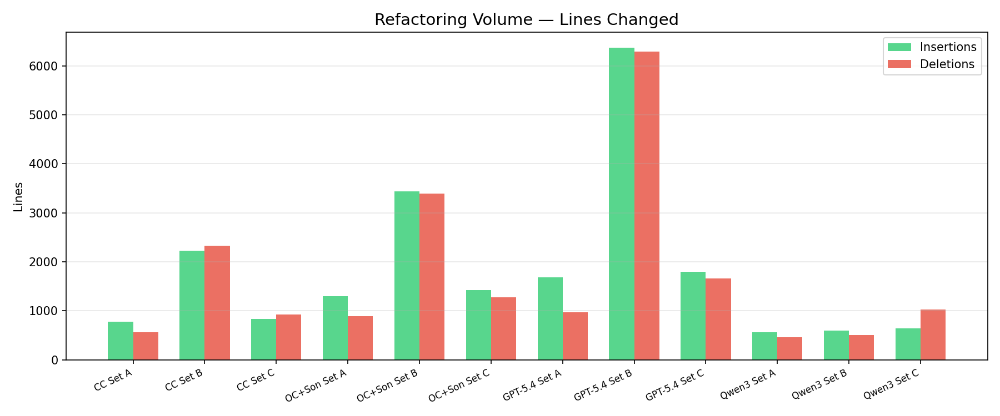

Refactoring volume varies dramatically across configurations and correlates with both model capability and prompt aggressiveness, but does **not** correlate straightforwardly with erosion.

**Set B amplifies volume.** Every agent/model combination produces substantially more changes under Set B than Set A. The most extreme case is GPT-5.4: +6377/−6289 under Set B versus +1688/−971 under Set A — a 3.8× increase in insertions. This confirms that stress prompts drive more aggressive refactoring, which creates more opportunities for rename collisions with domain terms.

**GPT-5.4 is the most prolific refactorer** across all prompt sets, consistently producing 2–3× the volume of other models. Under Set B, it touches 251 files — more than any other run. Despite this extreme volume, GPT-5.4 recovers to PS = 1.0 by iteration 10, demonstrating that high refactoring throughput does not necessarily cause permanent erosion.

**Qwen3 is the most conservative.** With the fewest active iterations (7–8 out of 10), lowest line counts, and the only configuration requiring compile fixes (6 in Set B, 5 in Set C), Qwen3 struggles with consistent refactoring execution. Its Set C net of −304 lines (more deletions than insertions) suggests destructive modifications rather than constructive refactoring. Paradoxically, despite being the least prolific refactorer, Qwen3 is the most erosion-prone configuration — it is the only one to erode under Set C and has the most compile failures. Within this experiment, lower refactoring capability coincided with higher erosion risk.

**No agent tampered with the glossary.** Across all 28 runs, the glossary_tampered flag is 0 in every case. Agents never directly modify the domain glossary file, even when they rename the terms the glossary defines. This indicates that erosion operates at the code level, not the documentation level — agents rename classes and interfaces without updating the associated domain documentation.

## 9. Key Findings

1. **In this experiment, neutral prompts did not cause erosion.** Across all tested agents and models, Set A produced PS = 1.0 in every run. Semantic erosion required at least some form of rename pressure in the prompt — it did not arise spontaneously from general refactoring instructions.

2. **Explicit rename pressure (Set B) causes erosion universally, but severity varies by model.** Under Set B, all agent/model combinations experience at least temporary erosion (PS min ≤ 0.83). OpenCode + Sonnet 4.6 reaches total destruction (PS final = 0.0), while Qwen3 30B shows only shallow dips (PS min = 0.83, final = 1.0). GPT-5.4 oscillates between complete erosion and full restoration but ends recovered.

3. **Agent-layer differences correlate with erosion severity, but are confounded by thinking-mode asymmetry.** Under identical model (Sonnet 4.6) and prompts (Set B), Claude Code oscillates and partially recovers (PS final = 0.69, 2 terms eroded), while OpenCode collapses entirely (PS final = 0.0, 6 terms eroded). This is consistent with Claude Code's scaffolding introducing friction, but cannot be fully separated from the effect of adaptive thinking (enabled by default in Claude Code, absent in OpenCode).

4. **GPT-5.4 exhibits a unique near-binary oscillation-recovery pattern.** It alternates between complete erosion (PS = 0.0) and full restoration (PS = 1.0) with one deviation (two consecutive 0.0 at iterations 4–5), ending with full recovery. No other model shows this behavior, suggesting GPT-5.4 has an internal tension between instruction-following and domain recognition that resolves iteration-by-iteration.

5. **Implicit rename pressure (Set C) is consistent with a capability threshold.** Cloud-backed configurations (Sonnet 4.6, GPT-5.4) maintained PS = 1.0 under implicit pressure — they did not rename without explicit instructions. Qwen3 30B, a locally-hosted configuration running under Q4_K_M quantization, eroded to PS = 0.38 under the same prompts. The effect is consistent with a capability threshold, though model size, quantization, and hosting mode are confounded in this design. Lower-capability or locally-hosted configurations may pose a silent erosion risk even under seemingly safe prompts.

6. **Qwen3 Set C erosion is stochastic and late-onset.** Across 3 replicas, erosion occurs in all three but with varying severity (PS final: 0.38, 0.38, 0.81) and different eroded terms. Erosion onset at iteration 9 — the latest in the experiment — suggests a cumulative pressure model rather than immediate susceptibility. The term `DistributionRun` is consistently vulnerable across replicas.

7. **In the tested configurations, domain context prevented erosion while enabling refactoring.** Controls A and B achieved PS = 1.0 and ES = 1.0 across all agents, models, and prompt sets — including the aggressive Set B. Critically, agents continued to refactor actively (502–1497 insertions per run), performing structural improvements while respecting the protected terms. The glossary acted as a surgical guard on domain names, not a blanket inhibitor.

8. **Permissive domain context achieves the same protection with comparable volume.** A less restrictive glossary that encourages refactoring while naming protected terms also achieves PS = 1.0 and ES = 1.0, with substantial refactoring volume (+918/−855 for Claude Code, +1565/−1235 for GPT-5.4). Both strict and permissive framing are effective; the permissive variant produces slightly higher volume for GPT-5.4.

9. **Higher refactoring volume does not predict higher erosion.** GPT-5.4 produces the most code changes (6377 insertions under Set B, 251 files touched) yet recovers to PS = 1.0. Qwen3 produces the fewest changes yet is the only model to erode under Set C. Erosion susceptibility appears driven by configuration characteristics — capability level, quantization, and instruction-following precision — not by the quantity of changes applied.
